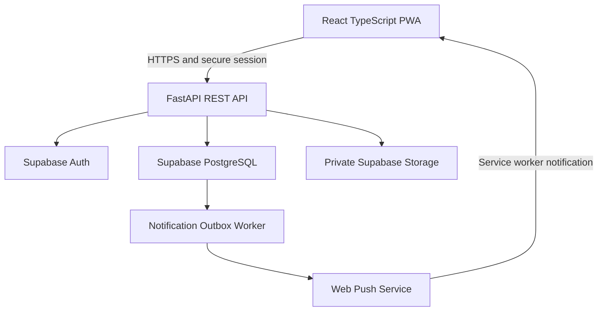
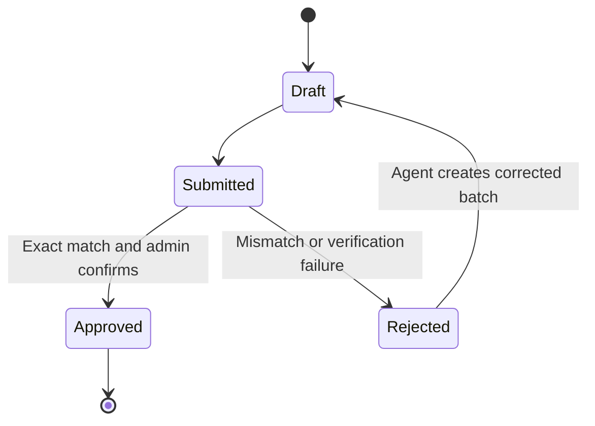
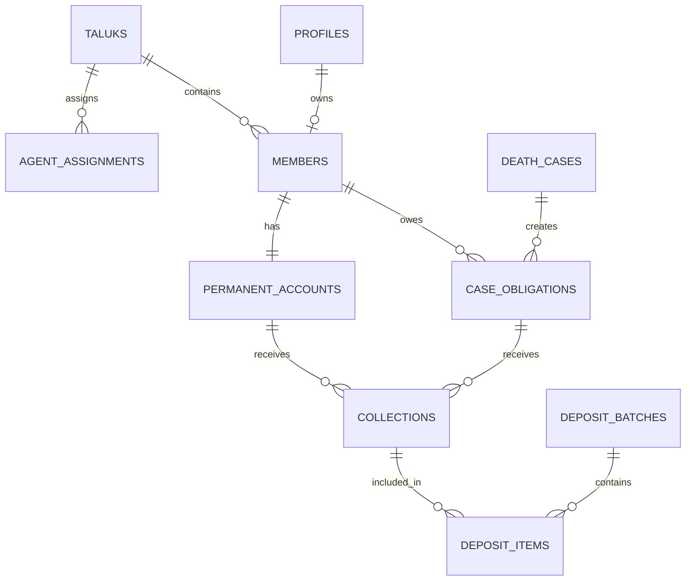

# Money Collection PWA — Complete Application Blueprint

**Document status:** Development-ready functional and technical blueprint  
**App name:** To be decided  
**Primary language:** English  
**Target devices:** iPhone, Android phone, tablet and desktop browser  
**Delivery model:** Responsive, installable Progressive Web App (PWA)  
**Frontend:** React + TypeScript  
**Backend:** Python FastAPI  
**Platform:** Supabase Auth, PostgreSQL and Storage

---

## 1. Purpose

This application manages helping-fund collections when an active member dies. Members are organized by taluk, and each taluk has exactly one active collection agent. The admin publishes a death case, the system assigns a contribution to every other active member, agents record money collected from their assigned members, agents deposit collected money into their separately assigned bank accounts, and the admin verifies each deposit.

The application also maintains a completely separate permanent-membership ledger. A member becomes permanent after ₹15,000 of permanent-membership payments have been verified. Permanent members must continue paying all future death-case contributions.

This blueprint treats all financial records as auditable ledger entries. Payments, deposit items and approval decisions must never be silently overwritten or deleted.

---

## 2. Confirmed Business Rules

### 2.1 Organization

1. A member belongs to exactly one taluk at a time.
2. Each taluk has exactly one active agent.
3. An agent can access only the members, collections and deposits assigned to that agent's taluk.
4. Admin creates all agent and member accounts.
5. Users sign in with a login ID and password.
6. The interface is English-only for the initial release.

### 2.2 Death cases

1. Admin creates and publishes a death case with the deceased member's photo and details.
2. Monthly case order is based on the date and time the admin creates the case, not the date of death.
3. The monthly count uses the `Asia/Kolkata` timezone and resets at the start of each calendar month.
4. Cases 1, 2 and 3 created in a month default to **₹200 per active member**.
5. Case 4 and every later case created in the same month default to **₹100 per active member**.
6. Admin can override the default amount. An override reason is mandatory for audit purposes.
7. Every active member, except the deceased member, receives an obligation for the published case.
8. The member who died becomes inactive/deceased and cannot sign in.
9. A member may pay the full case amount, pay partially, or leave it unpaid.
10. Member, assigned agent and admin can see required, collected, awaiting-verification, verified and remaining amounts.
11. A cancelled case keeps its monthly sequence number; sequence numbers are never reused. This prevents later cases and existing obligations from being silently renumbered.
12. A case can be cancelled only when it has no non-voided collection transactions. Otherwise cancellation is blocked so recorded money is never silently invalidated.

### 2.3 Permanent membership

1. Permanent membership is separate from death-case contributions.
2. The permanent-membership target is **₹15,000**.
3. A member may pay the permanent amount in multiple instalments.
4. Only admin-verified money counts toward the ₹15,000 target.
5. When the verified total reaches ₹15,000, the member is automatically marked as a permanent member.
6. Overpayment above the remaining permanent-membership balance is blocked.
7. Permanent members must continue paying all death-case contributions.

### 2.4 Collection and bank deposit

1. Members pay their assigned agent using cash, UPI, bank transfer or another recorded offline method.
2. The initial release has no direct in-app payment gateway.
3. The agent must record every collection in the app.
4. A collection can be a death-case contribution or a permanent-membership instalment.
5. One bank deposit can contain collections from one death case, multiple death cases, permanent-membership instalments, or a combination of these, provided every selected collection belongs to the same agent and taluk.
6. Because partial member payments are allowed, one death case can appear across multiple deposit batches.
7. Each taluk/agent has a separately configured bank account.
8. Uploading a bank receipt is optional for the initial release.
9. The admin cannot partially approve a deposit.
10. Approval is allowed only when the agent's declared deposited amount exactly equals the system-calculated total of the selected collection entries.
11. When a deposit is rejected, its collection entries are released and can be placed into a corrected deposit batch.
12. When a deposit is approved, only members whose collection entries are included in that deposit receive confirmation notifications.

### 2.5 Notifications

1. Publishing a death case creates an in-app notification and PWA push notification for all active agents and members.
2. Approved deposit notifications go only to the distinct members represented by that deposit's collection entries.
3. Rejected deposit notifications go to the submitting agent.
4. In-app notification history is the source of truth. Push delivery is best-effort because device permission, browser support or network availability can prevent delivery.

---

## 3. Recommended System Architecture



### 3.1 Frontend

- React with TypeScript and Vite
- React Router for role-aware routing
- TanStack Query for API state, caching and invalidation
- React Hook Form with Zod for form validation
- Tailwind CSS plus an accessible component system such as shadcn/ui
- Vite PWA/Workbox integration for manifest, service worker and installability
- IndexedDB only for non-sensitive UI preferences; do not cache financial API responses by default
- Responsive bottom navigation for member and agent mobile views
- Responsive sidebar navigation for admin desktop/tablet views

### 3.2 Backend

- FastAPI with versioned routes under `/api/v1`
- Pydantic request and response models
- SQLAlchemy 2 async and `asyncpg` for PostgreSQL access
- Alembic for database migrations
- Supabase Auth for password hashing, token lifecycle and user sessions
- Supabase Storage for death-case photos and optional deposit receipts
- A separate worker process that safely consumes a transactional notification outbox
- Structured JSON logs with request IDs and actor IDs

### 3.3 Access boundary

The PWA must use FastAPI as the authoritative application API. It must not directly write financial tables from the browser. FastAPI enforces business rules, authorization, row scope, idempotency and transaction locking.

Supabase browser/Data API access to application tables should be default-deny. The Supabase service-role key is server-only and is used only where required for Auth administration and Storage operations. It must never be included in frontend code.

---

## 4. Authentication Design

Supabase password authentication uses an email address or phone number internally. The user-facing requirement is a login ID, so use this mapping:

1. Admin enters a unique login ID and temporary password.
2. FastAPI normalizes the login ID to lowercase and creates an internal, non-user-facing Auth email alias, for example `member0001@app-auth.invalid`.
3. FastAPI creates the Supabase Auth user from the server and stores the Auth UUID and internal alias in the profile.
4. The login screen asks only for `login_id` and `password`.
5. `/auth/login` resolves the internal alias on the server and performs the Supabase password sign-in.
6. The first successful login requires the user to change the temporary password.

### 4.1 Session rules

- Use short-lived access tokens and rotating refresh tokens.
- Prefer a Secure, HttpOnly, SameSite cookie arrangement when frontend and API deployment domains allow it.
- Do not store long-lived tokens in `localStorage`.
- Protect cookie-based write requests with CSRF controls.
- Deny every request when `profiles.account_status` is not `ACTIVE`, even if an old token has not yet expired.
- Deactivate/revoke access when a member is marked deceased or when an admin disables an account.
- Rate-limit login and password-change endpoints.
- Admin reset creates a temporary password and sets `must_change_password = true`.

---

## 5. Roles and Permissions

| Capability | Admin | Agent | Member |
|---|---:|---:|---:|
| View own profile | Yes | Yes | Yes |
| Change own password | Yes | Yes | Yes |
| Create/manage taluks | Yes | No | No |
| Create/manage bank accounts | Yes | No | No |
| View full assigned bank account | Yes | Assigned account only | No |
| Create/manage agents | Yes | No | No |
| Create/manage members | Yes | No | No |
| View member directory | All members | Own taluk only | Own record only |
| Create/publish death case | Yes | No | No |
| View published death cases | All | All published cases | All published cases |
| View member obligations | All | Own taluk only | Own obligations only |
| Record a collection | No; agent is responsible | Own members only | No |
| Void and re-enter unbatched collection | No | Own unbatched entry only | No |
| Create/submit deposit | No | Own collections only | No |
| View deposit details | All | Own deposits only | Only own payment confirmations, not batch details |
| Approve/reject deposit | Yes | No | No |
| View permanent-membership ledger | All | Own taluk only | Own ledger only |
| View reports | All-system | Own taluk summary | Own history only |
| View audit log | Yes | No | No |
| View deposit receipt | Yes | Submitting agent only | No |
| View notifications | Own/admin operational view | Own only | Own only |
| Manage settings | Yes | No | No |

### 5.1 Object-level authorization

Role checks alone are insufficient. Every resource lookup must also validate ownership or taluk scope. For example, an agent must not retrieve another taluk's member by changing a member UUID in the URL.

---

## 6. UI Information Architecture

### 6.1 Shared and authentication pages

| Page | Purpose | Important elements |
|---|---|---|
| Login | Login ID/password authentication | Login ID, password, show/hide password, error state |
| First Login Password Change | Replace temporary password | Current password, new password, strength guidance |
| Account Disabled | Explain blocked access | Contact-admin message; no sensitive details |
| Install App | Explain PWA installation | Platform-specific install steps and install button where available |
| Offline/Connection State | Prevent unsafe financial writes | Connection banner, retry action, read-only message |
| My Profile | View account information | Name, login ID, role, taluk, password change |
| Notification Centre | Persistent notification history | Unread/read filters, case/payment deep links |

### 6.2 Admin pages

| Page | Purpose | Main content/actions |
|---|---|---|
| Admin Dashboard | System overview | Active members, permanent members, open cases, monthly death count, pending deposit reviews, outstanding dues, taluk collection totals |
| Death Cases | Search and monitor cases | Case number, deceased member, created date, monthly sequence, amount, status, collection progress |
| Create Death Case | Publish a new case | Select member, date of death, photo, details, automatic monthly rate preview, override and reason, confirmation summary |
| Death Case Detail | Complete case view | Photo/details, obligation totals, collection/verification totals, taluk breakdown, member payment table, audit timeline |
| Case Payment Register | Review member-level dues | Member, taluk, agent, required, collected, awaiting verification, verified, remaining, status |
| Deposit Review Queue | List submitted deposits | Agent, taluk, bank, calculated total, declared total, difference, date and age |
| Deposit Review Detail | Approve or reject | Selected collection entries grouped by case/member, bank snapshot, optional receipt, reference, exact-match validation, approve/reject reason |
| Members | Manage member directory | Search, filters, add member, import option, active/deceased state, membership type, dues |
| Create/Edit Member | Create login and profile | Member code, full name, taluk, phone, join date, login ID, temporary password |
| Member Detail | Full member account | Identity, taluk, agent, death-case ledger, permanent-membership progress, payment history, account actions |
| Permanent Membership | Monitor ₹15,000 targets | Member, collected, awaiting verification, verified, balance and permanent status |
| Agents | Manage collection agents | Agent identity, assigned taluk, assigned bank, active status, collection/deposit summary |
| Create/Edit Agent | Create agent login | Agent details, taluk assignment, login ID, temporary password |
| Taluks | Maintain taluk master | Taluk name/code, assigned agent, bank readiness, member count |
| Bank Accounts | Maintain one active account per taluk | Bank name, branch, IFSC, masked account number, account holder, active dates |
| Reports | Operational and financial reports | Outstanding dues, collection vs deposit, monthly cases, agent reconciliation, permanent-membership progress |
| Audit Log | Trace sensitive operations | Actor, action, entity, before/after summary, timestamp, IP/request ID |
| Settings | Manage controlled defaults | ₹200/₹100 rules, permanent target, file limits, notification templates |

### 6.3 Agent pages

| Page | Purpose | Main content/actions |
|---|---|---|
| Agent Dashboard | Today's operational view | Assigned member count, total pending, collected-not-deposited, deposits awaiting review, recent cases |
| Death Cases | View active/past cases | Case details, amount, taluk collection progress |
| Collection Sheet | Record case payments | Assigned member list, required amount, collected, remaining, quick collect action, filters for unpaid/partial/complete |
| Record Collection | Add an auditable payment | Member, collection type, case if applicable, amount, method, reference, date, note, confirmation |
| Members | Assigned taluk directory | Member code/name, pending total, permanent progress, contact information |
| Member Detail | Member-level collection view | Current dues, payment history, permanent account, record payment action |
| Unbatched Collections | Prepare bank deposit | Select eligible collection entries, group/filter by case, calculated total |
| Create Deposit Batch | Declare bank deposit | Selected entries, case/member breakdown, assigned bank account, calculated total, deposited amount, date, reference, optional receipt/message |
| Deposits | Track submitted batches | Draft, submitted, approved and rejected tabs |
| Deposit Detail | View batch result | Items, calculated/declared amount, admin decision, rejection reason and resubmit action |
| Permanent Membership Collections | Record and track instalments | Assigned member, target, balance, collected and verified totals |
| Notifications | Operational alerts | New case and deposit approval/rejection events |

### 6.4 Member pages

| Page | Purpose | Main content/actions |
|---|---|---|
| Member Dashboard | Personal financial summary | Amount still to give agent, amount awaiting verification, verified total, permanent progress, recent death cases and notifications |
| Death Cases | View all published cases | Deceased photo/name, case date, required contribution and personal status |
| Death Case Detail | Understand a case and own obligation | Photo/details, case amount, own collected/verified/remaining amounts and payment timeline |
| My Dues | View outstanding obligations | Unpaid and partially paid cases, amount still to give agent |
| My Payments | View all recorded payments | Date, case/type, agent, method, collected amount, deposit/verification status |
| Permanent Membership | Track separate ₹15,000 ledger | Progress bar, verified total, awaiting verification, remaining balance, permanent status |
| Payment Confirmation Detail | View approved collection confirmation | Amount, payment type/case, verification date and reference-safe details |
| Notifications | View case and payment alerts | Unread/read state and deep links |
| Account | View profile and security | Member code, taluk, agent name, login ID, password change |

---

## 7. Responsive and PWA UX Requirements

### 7.1 Responsive layout

- Design mobile-first from approximately 320 px width upward.
- Use bottom navigation for the 4–5 most important member/agent destinations.
- Use a collapsible sidebar for admin on tablet/desktop and a drawer on mobile.
- Tables must become cards or horizontally scrollable data grids on narrow screens.
- Keep primary actions reachable with one hand and provide at least 44×44 px touch targets.
- Never depend on hover for an essential action.
- Show currency consistently as Indian rupees using Indian digit grouping.
- Use status text plus color/icon; never use color alone.

### 7.2 PWA capabilities

- Web app manifest with app name, icons, theme color, `display: standalone`, start URL and scope.
- Service worker for static app-shell caching and push-event handling.
- Install guidance for iPhone and Android.
- Push permission should be requested after login and after a clear user action, not immediately on first page load.
- Provide a notification preference/device management screen.
- Detect application updates and present a safe “Update available” action.
- The production app and API must use HTTPS.

### 7.3 Offline policy

Financial writes should be disabled while offline in the initial release. Recording a payment or submitting a deposit offline creates duplicate and reconciliation risks. The PWA may cache the static shell and show a connection status screen, but it must reconnect before saving financial data.

---

## 8. Financial Status Model

Do not represent the complete payment lifecycle with a single ambiguous “paid” flag.

### 8.1 Member obligation amounts

For every death-case obligation, maintain:

- `required_amount`: Amount assigned to the member.
- `collected_amount`: Total valid money recorded by an agent, including money not yet deposited/approved.
- `verified_amount`: Total included in admin-approved deposits.
- `amount_still_to_collect = required_amount - collected_amount`.
- `amount_awaiting_verification = collected_amount - verified_amount`.
- `verified_balance = required_amount - verified_amount`.

The member-facing “amount to give agent” must use `amount_still_to_collect`, so a member is not asked to pay the same cash again while it is awaiting deposit verification.

### 8.2 Display status

| Condition | Display status |
|---|---|
| Collected = 0 | Unpaid |
| Collected is greater than 0 but less than required | Partially Paid |
| Collected = required and verified is less than required | Awaiting Verification |
| Verified = required | Verified |

If some partial collections are verified while a remaining amount is still due, show **Partially Paid** plus a separate verified/awaiting breakdown.

### 8.3 Deposit status



---

## 9. Core Workflows

### 9.1 Admin publishes a death case

1. Admin selects an active member as deceased.
2. UI displays the member's taluk, agent, and existing account state.
3. Admin enters death date, case details and uploads a photo.
4. Backend uses the server-side creation timestamp in `Asia/Kolkata` to determine the sequence month.
5. In one database transaction, backend locks the monthly counter and assigns the next sequence number.
6. Default amount is ₹200 for sequence 1–3 and ₹100 for sequence 4 onward.
7. If admin overrides the amount, the backend requires and stores a reason.
8. Backend deactivates the deceased member and excludes that member from the new obligations.
9. Backend snapshots all other active members, their taluks and responsible agents and creates one obligation per member.
10. Backend commits the case, obligations, audit entry, notification event, in-app recipient rows and push outbox jobs together.
11. Worker sends push notifications to all active members and agents; in-app notifications already exist even if push delivery fails.

**Precondition:** Every taluk containing active members must have an active agent and active bank account. The publish action must show a readiness error if this configuration is incomplete.

### 9.2 Agent records a collection

1. Agent selects an assigned member.
2. Agent selects either a death-case obligation or permanent-membership account.
3. UI shows required/target amount, already collected and remaining amount.
4. Agent enters amount, method, date and optional reference/note.
5. Backend locks the target obligation/account and rejects zero, negative, duplicate or over-limit entries.
6. Backend creates an immutable collection transaction with status `RECORDED`.
7. Backend updates ledger totals in the same transaction.
8. Member can immediately see that the amount was collected and is awaiting deposit verification.

### 9.3 Agent creates and submits a deposit batch

1. Agent opens unbatched collections.
2. Agent selects one or more entries. Entries may span multiple cases but must belong to that agent/taluk.
3. Backend calculates the total; frontend cannot supply the authoritative calculated total.
4. Agent enters actual deposited amount, date, bank reference, optional message and optional receipt.
5. Batch binds to the currently assigned bank account and stores a masked bank snapshot for history.
6. On submission, backend locks selected collections, confirms they are still unbatched, and marks them `BATCHED`.
7. Admin receives a review item.

### 9.4 Admin approves a deposit

1. Admin opens the deposit and reviews member/case breakdown, bank account, date, reference and optional receipt.
2. Backend independently recalculates the active deposit-item total.
3. Approval is blocked unless `declared_deposit_amount == calculated_total` exactly.
4. In one transaction, backend marks the deposit `APPROVED`, marks collections `VERIFIED`, updates obligation/permanent-account verified totals and records the audit entry.
5. If a permanent account reaches ₹15,000, membership type changes to `PERMANENT` and `permanent_since` is set.
6. Notification events are generated only for distinct members represented by approved deposit items.

### 9.5 Admin rejects a deposit

1. Admin selects a rejection reason and may enter a note.
2. Backend marks the batch `REJECTED`.
3. All active deposit items are released.
4. Their collection transactions return to `RECORDED`, preserving the fact that the agent collected the money.
5. Agent receives an in-app and push notification with the rejection reason.
6. Agent creates a corrected batch; the rejected batch remains immutable in history.

### 9.6 Agent replacement

1. Admin ends the current taluk assignment and assigns the new agent.
2. Future obligations use the new agent.
3. Uncollected open obligations may be reassigned to the new agent in a controlled migration.
4. Existing collection transactions and submitted deposits remain attached to the original agent for audit integrity.

---

## 10. Supabase Database Structure

### 10.1 PostgreSQL conventions

- UUID primary keys generated server-side.
- `timestamptz` for all event timestamps; store in UTC and display in `Asia/Kolkata`.
- `date` for join date, death date and sequence-month key.
- `numeric(12,2)` for all money. Never use binary floating-point types for currency.
- `citext` for case-insensitive login IDs and codes where appropriate.
- `created_at`, `updated_at` and optimistic `version` columns on mutable records.
- No hard deletion of financial, case, deposit or audit records.
- Foreign keys and check constraints enabled.
- All money-changing operations run inside database transactions with row locking.

### 10.2 Enums

| Enum | Values |
|---|---|
| `user_role` | `ADMIN`, `AGENT`, `MEMBER` |
| `account_status` | `ACTIVE`, `INACTIVE`, `DECEASED`, `LOCKED` |
| `membership_type` | `REGULAR`, `PERMANENT` |
| `death_case_status` | `OPEN`, `CLOSED`, `CANCELLED` |
| `collection_type` | `DEATH_CONTRIBUTION`, `PERMANENT_MEMBERSHIP` |
| `collection_method` | `CASH`, `UPI`, `BANK_TRANSFER`, `OTHER` |
| `collection_status` | `RECORDED`, `BATCHED`, `VERIFIED`, `VOIDED` |
| `deposit_status` | `DRAFT`, `SUBMITTED`, `APPROVED`, `REJECTED` |
| `notification_type` | `DEATH_CASE_CREATED`, `PAYMENT_VERIFIED`, `DEPOSIT_REJECTED`, `PASSWORD_RESET`, `SYSTEM` |

### 10.3 Identity and organization tables

#### `profiles`

| Column | Type | Rules/purpose |
|---|---|---|
| `id` | UUID PK | Application actor ID |
| `auth_user_id` | UUID unique FK to `auth.users.id` | Supabase identity |
| `login_id` | CITEXT unique | User-facing login ID |
| `auth_email_alias` | CITEXT unique | Internal Auth-only alias; never shown to user |
| `role` | `user_role` | Admin, agent or member |
| `full_name` | TEXT | Required |
| `phone` | TEXT nullable | Contact/display only in initial release |
| `account_status` | `account_status` | Controls API access |
| `must_change_password` | BOOLEAN | True for temporary passwords |
| `last_login_at` | TIMESTAMPTZ nullable | Operational information |
| `created_by` | UUID FK `profiles.id` nullable | Null for seeded first admin |
| `created_at`, `updated_at` | TIMESTAMPTZ | Audit timestamps |
| `version` | INTEGER | Optimistic concurrency |

#### `taluks`

| Column | Type | Rules/purpose |
|---|---|---|
| `id` | UUID PK | Taluk ID |
| `code` | CITEXT unique | Stable short code |
| `name` | TEXT unique | Display name |
| `district` | TEXT nullable | Optional reporting field |
| `is_active` | BOOLEAN | New assignment/member control |
| `created_at`, `updated_at` | TIMESTAMPTZ | Audit timestamps |

#### `agent_taluk_assignments`

| Column | Type | Rules/purpose |
|---|---|---|
| `id` | UUID PK | Assignment history ID |
| `agent_profile_id` | UUID FK `profiles.id` | Must have role `AGENT` |
| `taluk_id` | UUID FK `taluks.id` | Assigned taluk |
| `starts_at` | TIMESTAMPTZ | Assignment start |
| `ends_at` | TIMESTAMPTZ nullable | Null means current |
| `created_by` | UUID FK `profiles.id` | Admin actor |

Use partial unique indexes so a taluk has only one assignment with `ends_at IS NULL`, and an agent has no more than one current taluk assignment unless the business rule changes later.

#### `members`

| Column | Type | Rules/purpose |
|---|---|---|
| `id` | UUID PK | Member domain ID |
| `profile_id` | UUID unique FK `profiles.id` | Must have role `MEMBER` |
| `member_code` | CITEXT unique | Human-readable member number |
| `taluk_id` | UUID FK `taluks.id` | Current taluk |
| `joined_on` | DATE | Membership start |
| `membership_type` | `membership_type` | Regular/permanent; separate from account status |
| `permanent_since` | TIMESTAMPTZ nullable | Set when verified target reached |
| `deceased_at` | TIMESTAMPTZ nullable | Account deactivation timestamp |
| `created_at`, `updated_at` | TIMESTAMPTZ | Audit timestamps |
| `version` | INTEGER | Optimistic concurrency |

#### `bank_accounts`

| Column | Type | Rules/purpose |
|---|---|---|
| `id` | UUID PK | Bank configuration ID |
| `taluk_id` | UUID FK `taluks.id` | Owning taluk |
| `agent_profile_id` | UUID FK `profiles.id` | Assigned agent at activation |
| `bank_name` | TEXT | Required |
| `branch_name` | TEXT | Required |
| `account_holder_name` | TEXT | Required |
| `account_number_ciphertext` | TEXT | Encrypted server-side |
| `account_number_last4` | CHAR(4) | Safe masked display |
| `ifsc_code` | CITEXT | Validated format |
| `starts_at` | TIMESTAMPTZ | Active-period start |
| `ends_at` | TIMESTAMPTZ nullable | Null means active |
| `created_by` | UUID FK `profiles.id` | Admin actor |

Use a partial unique index for one active bank account per taluk. Historical deposits retain a masked snapshot even after the active bank account changes.

### 10.4 Death case and obligation tables

#### `monthly_case_counters`

| Column | Type | Rules/purpose |
|---|---|---|
| `sequence_month` | DATE PK | First day of month in Asia/Kolkata |
| `last_sequence` | INTEGER | Locked/incremented during case creation |
| `updated_at` | TIMESTAMPTZ | Audit timestamp |

#### `death_cases`

| Column | Type | Rules/purpose |
|---|---|---|
| `id` | UUID PK | Case ID |
| `case_number` | CITEXT unique | Example `DC-202608-004` |
| `deceased_member_id` | UUID FK `members.id` | Member who died |
| `death_date` | DATE | Informational; not used for monthly order |
| `title` | TEXT | Short case title |
| `details` | TEXT | Member-visible description |
| `photo_object_path` | TEXT | Private Storage object path |
| `sequence_month` | DATE | Month derived from creation time in IST |
| `monthly_sequence` | INTEGER | Immutable order number |
| `default_amount` | NUMERIC(12,2) | ₹200 or ₹100 from rule |
| `contribution_amount` | NUMERIC(12,2) | Final amount assigned |
| `is_amount_overridden` | BOOLEAN | Audit flag |
| `override_reason` | TEXT nullable | Required when overridden |
| `status` | `death_case_status` | Open/closed/cancelled |
| `created_by` | UUID FK `profiles.id` | Admin |
| `created_at`, `closed_at`, `cancelled_at` | TIMESTAMPTZ | Lifecycle timestamps |
| `version` | INTEGER | Optimistic concurrency |

Unique constraint: `(sequence_month, monthly_sequence)`.

#### `case_obligations`

| Column | Type | Rules/purpose |
|---|---|---|
| `id` | UUID PK | Member-case obligation ID |
| `death_case_id` | UUID FK `death_cases.id` | Parent case |
| `member_id` | UUID FK `members.id` | Responsible member |
| `taluk_id_snapshot` | UUID FK `taluks.id` | Assignment at publication |
| `responsible_agent_id` | UUID FK `profiles.id` | Agent currently responsible for uncollected due |
| `original_agent_id` | UUID FK `profiles.id` | Publication-time agent for audit |
| `required_amount` | NUMERIC(12,2) | Snapshot of case contribution |
| `collected_amount` | NUMERIC(12,2) | Transactionally maintained cache |
| `verified_amount` | NUMERIC(12,2) | Transactionally maintained cache |
| `created_at`, `updated_at` | TIMESTAMPTZ | Audit timestamps |
| `version` | INTEGER | Concurrency control |

Unique constraint: `(death_case_id, member_id)`. Check constraints enforce non-negative totals, `verified_amount <= collected_amount`, and `collected_amount <= required_amount`.

### 10.5 Permanent-membership tables

#### `permanent_membership_accounts`

| Column | Type | Rules/purpose |
|---|---|---|
| `id` | UUID PK | Permanent ledger ID |
| `member_id` | UUID unique FK `members.id` | One account per member |
| `target_amount` | NUMERIC(12,2) | Default ₹15,000 |
| `collected_amount` | NUMERIC(12,2) | Recorded instalments |
| `verified_amount` | NUMERIC(12,2) | Approved instalments |
| `achieved_at` | TIMESTAMPTZ nullable | When verified target reached |
| `created_at`, `updated_at` | TIMESTAMPTZ | Audit timestamps |
| `version` | INTEGER | Concurrency control |

Check constraints mirror the death-obligation amount constraints and block totals above the target.

### 10.6 Collection and deposit tables

#### `collection_transactions`

| Column | Type | Rules/purpose |
|---|---|---|
| `id` | UUID PK | Immutable collection entry |
| `receipt_number` | CITEXT unique | Human-readable receipt ID |
| `collection_type` | `collection_type` | Death or permanent payment |
| `member_id` | UUID FK `members.id` | Paying member |
| `agent_profile_id` | UUID FK `profiles.id` | Collecting agent |
| `taluk_id` | UUID FK `taluks.id` | Taluk at collection |
| `case_obligation_id` | UUID nullable FK | Required for death contribution |
| `permanent_account_id` | UUID nullable FK | Required for permanent payment |
| `amount` | NUMERIC(12,2) | Greater than zero |
| `method` | `collection_method` | Cash/UPI/bank/other |
| `external_reference` | TEXT nullable | UPI/bank/manual reference |
| `note` | TEXT nullable | Optional agent note |
| `collected_at` | TIMESTAMPTZ | Actual collection time |
| `status` | `collection_status` | Recorded/batched/verified/voided |
| `created_by` | UUID FK `profiles.id` | Actor who entered it |
| `voided_by`, `voided_at`, `void_reason` | Nullable audit fields | No physical deletion |
| `client_request_id` | UUID | Idempotency/duplicate protection |
| `created_at`, `updated_at` | TIMESTAMPTZ | Audit timestamps |

Add an XOR check constraint so exactly one of `case_obligation_id` and `permanent_account_id` is populated and it matches `collection_type`.

#### `deposit_batches`

| Column | Type | Rules/purpose |
|---|---|---|
| `id` | UUID PK | Deposit batch ID |
| `deposit_number` | CITEXT unique | Human-readable ID |
| `agent_profile_id` | UUID FK `profiles.id` | Submitting agent |
| `taluk_id` | UUID FK `taluks.id` | Must match agent assignment |
| `bank_account_id` | UUID FK `bank_accounts.id` | Configured destination |
| `bank_snapshot` | JSONB | Masked immutable bank display fields |
| `calculated_total` | NUMERIC(12,2) | Server sum of active items |
| `declared_deposit_amount` | NUMERIC(12,2) | Agent-entered bank deposit amount |
| `deposited_at` | TIMESTAMPTZ | Actual deposit time |
| `bank_reference` | TEXT nullable | Deposit/transaction reference |
| `receipt_object_path` | TEXT nullable | Optional private Storage file |
| `agent_message` | TEXT nullable | Message to admin |
| `status` | `deposit_status` | Draft/submitted/approved/rejected |
| `submitted_at` | TIMESTAMPTZ nullable | Submission time |
| `reviewed_by` | UUID nullable FK `profiles.id` | Admin reviewer |
| `reviewed_at` | TIMESTAMPTZ nullable | Decision time |
| `rejection_reason` | TEXT nullable | Required when rejected |
| `created_at`, `updated_at` | TIMESTAMPTZ | Audit timestamps |
| `version` | INTEGER | Optimistic concurrency |

#### `deposit_items`

| Column | Type | Rules/purpose |
|---|---|---|
| `id` | UUID PK | Batch line ID |
| `deposit_batch_id` | UUID FK `deposit_batches.id` | Parent batch |
| `collection_transaction_id` | UUID FK `collection_transactions.id` | Included collection |
| `amount_snapshot` | NUMERIC(12,2) | Immutable collection amount |
| `released_at` | TIMESTAMPTZ nullable | Set when rejected/released |
| `created_at` | TIMESTAMPTZ | Audit timestamp |

Use a partial unique index on `collection_transaction_id WHERE released_at IS NULL` so a collection cannot be in two active batches but can be rebatched after rejection.

### 10.7 Notification and audit tables

#### `notification_events`

Stores one logical event: type, title, body template/data, deep-link route, related entity type/ID and creation time.

#### `notification_recipients`

Stores `event_id`, `profile_id`, member-specific `recipient_payload` JSON, `read_at`, `push_status`, `push_attempts`, `last_attempt_at` and failure code. Unique on `(event_id, profile_id)`.

#### `push_subscriptions`

Stores `profile_id`, browser endpoint, encrypted subscription keys, device label, user agent, `created_at`, `last_used_at` and `revoked_at`. A user may have multiple devices.

#### `notification_outbox`

Stores transactionally committed delivery jobs with status, attempt count, next-attempt time and last error. The worker uses row locking/`SKIP LOCKED` so jobs are processed once safely and failed pushes can be retried.

#### `audit_logs`

Append-only table containing actor, role, action, entity type/ID, safe before/after JSON, request ID, IP hash/metadata, user agent and timestamp. Never store plaintext passwords, tokens, full bank account numbers or push private keys in audit JSON.

#### `app_settings`

Versioned settings such as first-three amount, later-case amount, permanent-membership target, timezone, upload limits and notification template versions. Changes require admin role and an audit entry.

### 10.8 Core relationship view



---

## 11. Database Indexes and Integrity Controls

Minimum indexes:

- `profiles(login_id)` unique and `profiles(auth_user_id)` unique.
- `members(member_code)` unique and `(taluk_id, account status through profile)` lookup support.
- Partial unique active agent assignment by taluk.
- Partial unique active bank account by taluk.
- `death_cases(created_at DESC)`, `(sequence_month, monthly_sequence)` unique and `(status, created_at DESC)`.
- `case_obligations(member_id, death_case_id)`, `(responsible_agent_id, updated_at)` and indexes supporting unpaid/partial filters.
- `collection_transactions(agent_profile_id, status, collected_at)`, `(member_id, collected_at DESC)` and `client_request_id` unique per actor.
- `deposit_batches(status, submitted_at)`, `(agent_profile_id, created_at DESC)`.
- Active `deposit_items(collection_transaction_id)` partial unique index.
- `notification_recipients(profile_id, read_at, created/event ordering)`.
- `audit_logs(entity_type, entity_id, created_at)` and `(actor_profile_id, created_at)`.

Important controls:

- Lock obligation/account rows while recording payments to prevent overcollection.
- Lock monthly counters while creating cases to prevent duplicate sequence numbers.
- Lock collection rows while submitting a deposit to prevent double batching.
- Recalculate deposit totals at submission and approval; never trust a frontend total.
- Use database transactions for every status transition and its audit/outbox records.
- Use idempotency keys for collection creation, case publication, deposit submission and approval.

---

## 12. Supabase Storage Structure

Use private buckets only.

| Bucket | Example object path | Access |
|---|---|---|
| `death-case-photos` | `{case_id}/original/{uuid}.jpg` | Admin uploads; authenticated users receive short-lived signed read URLs for published cases |
| `deposit-receipts` | `{agent_id}/{deposit_id}/{uuid}.jpg` | Submitting agent uploads; only that agent and admin receive signed read URLs |

### 12.1 File rules

- Allow JPEG, PNG and WebP photos; optionally PDF for deposit receipts.
- Validate MIME type from file content, not filename alone.
- Define a configurable size limit, for example 5–10 MB.
- Strip unsafe filenames and generate object names server-side.
- Store object paths in database rows; never store expiring signed URLs.
- Compress oversized death-case images and create a display thumbnail.
- Do not expose buckets publicly.
- Do not cache signed private file URLs in the PWA service worker.

---

## 13. Row-Level Security and Database Permissions

### 13.1 Recommended initial policy

Because all business data flows through FastAPI:

1. Enable RLS on every table in the exposed `public` schema.
2. Grant no direct `anon` writes to application tables.
3. Grant no direct `authenticated` financial writes.
4. Prefer default-deny direct reads as well; FastAPI returns scoped DTOs.
5. Keep Supabase service-role and database credentials only in backend/worker secrets.
6. Use a restricted backend database role for routine database work where practical.
7. FastAPI must enforce both role and object/taluk scope for every query and mutation.

If a future version reads selected tables directly through Supabase Realtime/Data API, add explicit RLS policies equivalent to the permission matrix; do not weaken the FastAPI checks.

### 13.2 Storage policies

- No public bucket reads.
- Upload intents/signed upload URLs are issued only after FastAPI permission checks.
- Signed view URLs are short-lived and issued only to allowed actors.
- An agent can access only receipts for that agent's deposits.
- Members can access death-case photos only for published, non-cancelled cases.

---

## 14. FastAPI Endpoint Blueprint

All endpoints use `/api/v1`. Unless stated otherwise, they require authentication. List endpoints use cursor pagination and role-scoped filters.

### 14.1 Authentication and shared endpoints

| Method and path | Purpose | Access |
|---|---|---|
| `POST /auth/login` | Resolve login ID, validate password and create session | Public, rate-limited |
| `POST /auth/refresh` | Rotate/refresh session | Auth session |
| `POST /auth/logout` | Revoke current session/cookie | All roles |
| `POST /auth/change-password` | Change own password and clear first-login flag | All roles |
| `GET /me` | Return role-scoped profile and navigation permissions | All roles |
| `GET /app-config` | Safe client settings: app name, version, install config | Public/authenticated safe fields only |
| `GET /notifications` | List own notification recipients/events | All roles |
| `PATCH /notifications/{recipient_id}/read` | Mark own notification read | Owner only |
| `POST /notifications/read-all` | Mark all own notifications read | Owner only |
| `POST /push-subscriptions` | Register/update current device subscription | All roles |
| `DELETE /push-subscriptions/{id}` | Revoke own device subscription | Owner only |
| `GET /death-cases` | List published cases using role-safe projection | All roles |
| `GET /death-cases/{case_id}` | Published case detail plus own/allowed payment data | All roles, projected by role |

### 14.2 Admin endpoints — organization and users

| Method and path | Purpose |
|---|---|
| `GET /admin/dashboard` | System KPIs and pending actions |
| `GET/POST /admin/taluks` | List/create taluks |
| `GET/PATCH /admin/taluks/{id}` | View/update taluk |
| `GET/POST /admin/bank-accounts` | List/create bank configurations |
| `GET/PATCH /admin/bank-accounts/{id}` | View/update/end bank configuration |
| `GET/POST /admin/agents` | List/create agent plus Auth account |
| `GET/PATCH /admin/agents/{id}` | View/update/disable agent |
| `POST /admin/agents/{id}/assign-taluk` | Create controlled taluk assignment |
| `POST /admin/agents/{id}/end-assignment` | End assignment after validation |
| `GET/POST /admin/members` | List/create member plus Auth account |
| `GET/PATCH /admin/members/{id}` | View/update member |
| `POST /admin/members/{id}/deactivate` | Deactivate for a non-death administrative reason |
| `POST /admin/members/{id}/reactivate` | Reactivate where allowed |
| `POST /admin/users/{profile_id}/reset-password` | Set temporary password and force change |
| `POST /admin/users/{profile_id}/lock` | Lock access |
| `POST /admin/users/{profile_id}/unlock` | Unlock access |

### 14.3 Admin endpoints — death cases

| Method and path | Purpose |
|---|---|
| `POST /admin/death-cases/preview` | Show next monthly sequence and default amount without reserving it |
| `POST /admin/death-cases/photo-upload-intent` | Authorize a temporary private case-photo upload |
| `POST /admin/death-cases` | Atomically create/publish case, deactivate deceased member and generate obligations |
| `GET /admin/death-cases` | Admin case list and filters |
| `GET /admin/death-cases/{id}` | Full case, totals and configuration |
| `GET /admin/death-cases/{id}/obligations` | Paginated member payment register |
| `POST /admin/death-cases/{id}/close` | Close a case with confirmation and audit |
| `POST /admin/death-cases/{id}/cancel` | Cancel only under controlled rules; never delete |

The preview is advisory. The final sequence and default rate must be recalculated inside the create transaction because another admin could create a case between preview and submission.

The create request references a completed temporary photo object. After a successful transaction, the object is attached to the case. A scheduled cleanup removes abandoned temporary uploads.

### 14.4 Agent endpoints — members and collections

| Method and path | Purpose |
|---|---|
| `GET /agent/dashboard` | Assigned-taluks KPIs and tasks |
| `GET /agent/members` | Search own assigned members |
| `GET /agent/members/{id}` | Own member detail and ledgers |
| `GET /agent/death-cases/{id}/collection-sheet` | Own taluk's member obligations for a case |
| `GET /agent/collections` | Own collection history/unbatched filters |
| `POST /agent/collections` | Record death or permanent collection |
| `POST /agent/collections/{id}/void` | Void only an own `RECORDED`, unbatched entry with reason; create a new entry for corrections |
| `GET /agent/permanent-memberships` | Assigned members' permanent-account progress |

Example collection request:

```json
{
  "client_request_id": "0672e1d8-0a24-4d20-87cf-c9e3bcc6d6aa",
  "member_id": "uuid",
  "collection_type": "DEATH_CONTRIBUTION",
  "case_obligation_id": "uuid",
  "amount": "100.00",
  "method": "CASH",
  "collected_at": "2026-08-08T14:30:00+05:30",
  "external_reference": null,
  "note": null
}
```

Money is transmitted as a decimal string in JSON to avoid client floating-point errors.

### 14.5 Agent endpoints — deposits

| Method and path | Purpose |
|---|---|
| `GET /agent/deposit-eligible-collections` | List own `RECORDED` collections not in an active batch |
| `POST /agent/deposits` | Create draft batch from selected collection IDs |
| `GET /agent/deposits` | List own deposits by status |
| `GET /agent/deposits/{id}` | View own batch and item breakdown |
| `POST /agent/deposits/{id}/items` | Add eligible collections to draft |
| `DELETE /agent/deposits/{id}/items/{item_id}` | Remove an item from draft |
| `PATCH /agent/deposits/{id}` | Update draft declared amount/date/reference/message |
| `POST /agent/deposits/{id}/receipt-upload-intent` | Obtain controlled optional receipt upload |
| `POST /agent/deposits/{id}/submit` | Lock items and submit for review |
| `POST /agent/deposits/{id}/abandon` | Abandon draft and release draft items |

### 14.6 Admin endpoints — deposit verification

| Method and path | Purpose |
|---|---|
| `GET /admin/deposits` | Review queue and history |
| `GET /admin/deposits/{id}` | Full review data and recalculated totals |
| `POST /admin/deposits/{id}/approve` | Exact-match, transactional full approval |
| `POST /admin/deposits/{id}/reject` | Full rejection with required reason and item release |

Approval request should contain an idempotency key and expected row `version`, but no client-provided approval amount.

### 14.7 Member endpoints

| Method and path | Purpose |
|---|---|
| `GET /member/dashboard` | Own summary and recent activity |
| `GET /member/dues` | Own death obligations and remaining-to-collect amount |
| `GET /member/dues/{obligation_id}` | Own case payment breakdown |
| `GET /member/payments` | Own collection and verification history |
| `GET /member/permanent-membership` | Own ₹15,000 account and progress |
| `GET /member/payment-confirmations/{collection_id}` | Safe own confirmation view |

### 14.8 Reports and audit endpoints

| Method and path | Purpose | Access |
|---|---|---|
| `GET /admin/reports/outstanding-dues` | Member/case/taluk pending amounts | Admin |
| `GET /admin/reports/collection-deposit-reconciliation` | Collected, unbatched, submitted and verified totals | Admin |
| `GET /admin/reports/monthly-cases` | Monthly case count and rates | Admin |
| `GET /admin/reports/permanent-memberships` | ₹15,000 progress and permanent conversions | Admin |
| `POST /admin/reports/exports` | Create CSV export from allowed report/filter | Admin |
| `GET /admin/audit-logs` | Search append-only audit records | Admin |
| `GET /agent/reports/summary` | Own taluk summary | Agent |

### 14.9 Permanent membership and settings endpoints

| Method and path | Purpose | Access |
|---|---|---|
| `GET /admin/permanent-memberships` | Search all permanent-account ledgers and balances | Admin |
| `GET /admin/permanent-memberships/{member_id}` | View a member's permanent-payment entries | Admin |
| `GET /admin/settings` | Read controlled business settings and current version | Admin |
| `PATCH /admin/settings` | Update allowed defaults with expected version and audit reason | Admin |

---

## 15. API Standards

### 15.1 Response format

Success:

```json
{
  "data": {},
  "meta": {
    "request_id": "req_uuid"
  }
}
```

Error:

```json
{
  "error": {
    "code": "DEPOSIT_TOTAL_MISMATCH",
    "message": "The deposited amount must equal the selected collection total.",
    "field_errors": {}
  },
  "meta": {
    "request_id": "req_uuid"
  }
}
```

### 15.2 Important error codes

- `AUTH_INVALID_CREDENTIALS`
- `ACCOUNT_INACTIVE`
- `PASSWORD_CHANGE_REQUIRED`
- `FORBIDDEN_RESOURCE`
- `TALUK_AGENT_NOT_CONFIGURED`
- `TALUK_BANK_NOT_CONFIGURED`
- `CASE_SEQUENCE_CONFLICT`
- `COLLECTION_EXCEEDS_BALANCE`
- `COLLECTION_ALREADY_BATCHED`
- `DEPOSIT_TOTAL_MISMATCH`
- `DEPOSIT_NOT_SUBMITTED`
- `DEPOSIT_ALREADY_REVIEWED`
- `VERSION_CONFLICT`
- `IDEMPOTENCY_CONFLICT`

### 15.3 General API rules

- Return `401` for missing/invalid authentication and `403` for an authenticated actor without permission.
- Return `404` rather than exposing the existence of another agent/member's private object where appropriate.
- Return `409` for state/version/idempotency conflicts.
- Return `422` for validation errors.
- Use cursor pagination for large lists.
- Support safe sort/filter allowlists; never interpolate client-provided SQL fields.
- Require `Idempotency-Key` for money-changing POST operations.
- Use `ETag`/version or an `expected_version` field for conflicting admin/agent edits.

---

## 16. Notification Design

### 16.1 Event templates

**Death case created**

- Audience: all active members and agents
- Title: `New helping request`
- Body: `{deceased_name} — contribution ₹{amount}`
- Deep link: `/cases/{case_id}`

**Payment verified**

- Audience: only members with collection entries in approved deposit
- Title: `Payment verified`
- Body: `₹{member_total_in_deposit} has been verified.`
- Deep link: `/my-payments?deposit={deposit_id}`
- If the batch includes multiple cases/types for the same member, the detail page shows the breakdown.

**Deposit rejected**

- Audience: submitting agent
- Title: `Deposit needs correction`
- Body: Includes a safe, concise rejection reason
- Deep link: `/agent/deposits/{deposit_id}`

### 16.2 Delivery guarantees

- The database/in-app notification is committed with the business transaction.
- Push is delivered asynchronously from the outbox.
- Retry transient failures with exponential backoff.
- Disable a subscription after a permanent “gone/invalid subscription” response.
- Never roll back an approved deposit merely because push delivery fails.
- Clicking a push notification opens the correct role-safe route after login.

---

## 17. Reports and Reconciliation

### 17.1 Required admin reports

1. Outstanding dues by case, member, taluk and agent.
2. Case collection summary: required, collected, awaiting deposit approval, verified and remaining.
3. Agent reconciliation: recorded collections, unbatched collections, submitted deposits, rejected deposits and approved deposits.
4. Deposit register with item-level drill-down.
5. Monthly death cases with sequence, default amount, override and reason.
6. Permanent-membership progress and newly permanent members.
7. Inactive/deceased member register.
8. Notification delivery summary.
9. Audit activity report.

### 17.2 Reconciliation equation

For an agent and selected reporting period:

```text
Recorded valid collections
= unbatched recorded collections
 + active submitted deposit items
 + approved/verified deposit items
```

Rejected deposit items are released and return to the unbatched recorded amount. Voided transactions are excluded but remain visible in audit history.

---

## 18. Security and Privacy Requirements

1. HTTPS only in production.
2. Supabase service-role key, database URL, internal alias domain, encryption key and Web Push private key remain server-side secrets.
3. Never log passwords, access/refresh tokens, full bank account numbers, Auth aliases or push private keys.
4. Mask bank accounts everywhere except the assigned agent/admin configuration view where full access is necessary.
5. Encrypt full bank account numbers at the application layer with a managed key and key rotation plan.
6. Validate JWT issuer, audience, signature and expiry on every request.
7. Enforce account status and current role from the database; do not trust a frontend role value.
8. Enforce taluk/member ownership at service/repository level.
9. Add login rate limits, progressive delay and security audit events.
10. Use signed, short-lived Storage URLs.
11. Validate uploaded file size and content type; reject executable or malformed content.
12. Exclude all API responses and private Storage files from service-worker caching.
13. Protect mutable financial operations with idempotency, row locks and version checks.
14. Keep append-only audit records for case creation, amount override, collection edit/void, deposit submission/decision, bank change, account state change and password reset.
15. Back up PostgreSQL according to the selected Supabase plan and periodically test restoration.
16. Define a retention policy before production; financial/audit records should not be casually deleted.

---

## 19. Validation and Edge Cases

| Scenario | Required behavior |
|---|---|
| Two admins create cases simultaneously | Row-locked monthly counter gives unique sequential numbers and correct ₹200/₹100 defaults |
| Admin preview shows case 3 but another case is created first | Create endpoint recalculates final sequence/rate and UI confirms changed result |
| Admin overrides amount | Positive amount and mandatory reason; saved in audit |
| Member pays ₹50 against ₹200 | Obligation shows ₹50 collected and ₹150 still to give agent |
| ₹50 is deposited and approved | Shows ₹50 verified and ₹150 remaining |
| Agent tries to record more than remaining | API rejects with `COLLECTION_EXCEEDS_BALANCE` |
| Agent selects a collection already batched elsewhere | API rejects atomically |
| One deposit contains two death cases | Supported; deposit detail groups items by case and member |
| Declared deposit differs by ₹0.01 | Approval is blocked; no tolerance or partial approval |
| Admin rejects deposit | Collections remain recorded and become eligible for a corrected batch |
| Receipt is absent | Submission remains valid in initial release |
| Member reaches exactly ₹15,000 verified | Membership becomes permanent; future death obligations continue |
| Member is declared deceased | Login disabled; excluded from new case; prior records retained |
| Agent changes | New/open uncollected work is deliberately reassigned; old collections/deposits retain original agent |
| Bank account changes | New deposits use new account; prior deposits retain masked snapshot |
| Case is cancelled | Allowed only before any non-voided collection; no deletion or sequence reuse; cancellation is audited |
| Push permission denied | In-app notification still exists; app can show how to enable notifications later |
| Duplicate mobile request | Same idempotency key returns original result, not a second payment |

---

## 20. Suggested Frontend Routes

```text
/login
/change-password
/install
/notifications
/profile

/admin/dashboard
/admin/cases
/admin/cases/new
/admin/cases/:id
/admin/deposits
/admin/deposits/:id
/admin/members
/admin/members/:id
/admin/agents
/admin/agents/:id
/admin/taluks
/admin/bank-accounts
/admin/permanent-memberships
/admin/reports
/admin/audit
/admin/settings

/agent/dashboard
/agent/cases
/agent/cases/:id/collections
/agent/members
/agent/members/:id
/agent/collections
/agent/deposits
/agent/deposits/new
/agent/deposits/:id
/agent/permanent-memberships

/member/dashboard
/member/cases
/member/cases/:id
/member/dues
/member/payments
/member/payments/:id
/member/permanent-membership
```

Route guards redirect authenticated users to their role dashboard and prevent rendering unauthorized screens. Backend authorization remains mandatory even when frontend guards exist.

---

## 21. Suggested Repository Structure

```text
money-collection-app/
├── frontend/
│   ├── src/
│   │   ├── app/
│   │   ├── api/
│   │   ├── auth/
│   │   ├── components/
│   │   ├── features/
│   │   │   ├── cases/
│   │   │   ├── collections/
│   │   │   ├── deposits/
│   │   │   ├── members/
│   │   │   ├── notifications/
│   │   │   └── permanent-membership/
│   │   ├── layouts/
│   │   ├── routes/
│   │   └── service-worker/
│   ├── public/
│   │   ├── icons/
│   │   └── manifest.webmanifest
│   └── tests/
├── backend/
│   ├── app/
│   │   ├── api/v1/
│   │   ├── auth/
│   │   ├── core/
│   │   ├── db/
│   │   ├── models/
│   │   ├── repositories/
│   │   ├── schemas/
│   │   ├── services/
│   │   ├── notifications/
│   │   └── main.py
│   ├── alembic/
│   └── tests/
├── worker/
│   ├── notifications/
│   └── main.py
├── docs/
├── .github/workflows/
└── README.md
```

---

## 22. Configuration and Secrets

Example environment-variable names; values must never be committed:

```text
APP_ENV
APP_BASE_URL
API_BASE_URL
DATABASE_URL
SUPABASE_URL
SUPABASE_PUBLISHABLE_KEY
SUPABASE_SERVICE_ROLE_KEY
SUPABASE_JWT_ISSUER
SUPABASE_JWKS_URL
AUTH_ALIAS_DOMAIN
BANK_FIELD_ENCRYPTION_KEY
VAPID_PUBLIC_KEY
VAPID_PRIVATE_KEY
VAPID_SUBJECT
ALLOWED_ORIGINS
LOG_LEVEL
```

Use separate Supabase projects and secrets for development, test/staging and production.

---

## 23. Testing Strategy

### 23.1 Unit tests

- Monthly amount for sequence 1, 2, 3, 4 and later.
- Month boundary using Asia/Kolkata.
- Admin override validation.
- Partial payment totals and overpayment prevention.
- Permanent target conversion at ₹15,000.
- Multi-case deposit calculation.
- Exact deposit-match approval rule.
- Rejection item release.
- Role and taluk object authorization.
- Notification recipient selection.

### 23.2 Integration tests

- Supabase Auth user creation/login/reset/disable lifecycle.
- Database transactions and concurrent row locking.
- Private Storage upload and signed access.
- Case publication creates correct obligation snapshot.
- Deposit approval updates every collection and ledger atomically.
- Transactional outbox survives worker failure/retry.
- Default-deny RLS/Data API behavior.

### 23.3 End-to-end tests

- Admin creates member and agent accounts.
- Admin publishes first, third and fourth cases in a month.
- Agent records full and partial member payments.
- Agent combines two cases into one deposit.
- Admin rejects a mismatch and agent resubmits.
- Admin approves and only included members receive confirmation.
- Member views case, balance, verification and permanent progress on iPhone- and Android-sized viewports.
- PWA install, update and push-click navigation.

### 23.4 Financial invariants

Automated tests must continuously prove:

- Verified amount never exceeds collected amount.
- Collected amount never exceeds required/target amount.
- A collection is present in at most one active deposit.
- An approved deposit's declared amount equals its active item sum.
- Every approval/rejection has one admin actor and audit entry.
- No transaction becomes verified without an approved deposit.

---

## 24. Deployment Topology

1. Host the React PWA on an HTTPS static/CDN platform.
2. Deploy FastAPI as a containerized web service.
3. Deploy the notification worker as a separate continuously running process.
4. Use Supabase for managed PostgreSQL, Auth and private Storage.
5. Put frontend and API under compatible first-party domains where possible, for example `app.example.org` and `api.example.org`.
6. Run Alembic migrations as an explicit release step before new backend code receives traffic.
7. Add health endpoints:
   - `/health/live`
   - `/health/ready` with safe database/dependency checks
8. Use centralized logs, error tracking, uptime monitoring and alerts for failed notification outbox jobs and database errors.

---

## 25. Delivery Phases

### Phase 1 — Foundation

- Supabase projects and database migrations
- Authentication and role middleware
- Taluk, agent, bank and member administration
- Responsive app shell and PWA installability

### Phase 2 — Death cases and ledgers

- Monthly rule engine
- Case creation/photo publishing
- Member obligation generation
- Admin/agent/member case views
- Permanent-membership accounts

### Phase 3 — Collections and deposits

- Full/partial collection recording
- Multi-case deposit batching
- Admin approve/reject workflow
- Reconciliation and audit logs

### Phase 4 — Notifications and reporting

- In-app notifications
- PWA Web Push and subscription management
- Admin and agent reports
- CSV exports

### Phase 5 — Hardening and launch

- Security review
- Concurrency, load and recovery tests
- Mobile/browser QA
- Backup/restore validation
- User acceptance testing and production release

---

## 26. MVP Acceptance Criteria

The initial release is ready only when all of the following are true:

1. The app installs and works responsively on supported iPhone and Android browsers.
2. Admin can create agents/members using login ID and temporary password.
3. Exactly one active agent and one active bank account can be configured per taluk.
4. Case order and ₹200/₹100 default calculation are correct under concurrent creation.
5. Publishing a case deactivates the deceased member and creates obligations for all other active members.
6. Admin override is supported and audited.
7. Agent can record full/partial cash or online collections without overcollection.
8. Member, agent and admin see correct collected, awaiting-verification, verified and remaining amounts.
9. Agent can combine eligible collections from one or multiple cases in a deposit.
10. Admin cannot approve any amount mismatch and cannot partially approve.
11. Rejected batches release collections safely for resubmission.
12. Approved batches atomically update ledgers and notify only included members.
13. Verified permanent payments reaching ₹15,000 mark the member permanent without removing future contribution obligations.
14. Financial actions are permission-scoped, idempotent and audited.
15. Private photos/receipts are not publicly accessible.
16. In-app notification history works even when Web Push is unavailable or denied.

---

## 27. Recommended Decisions Captured by This Blueprint

These implementation decisions close gaps while preserving the confirmed use case:

- Case creation and publication are one final action in the MVP. A preview does not reserve the monthly sequence.
- Cancelled case sequence numbers are not reused.
- Permanent-membership instalments use the same agent collection and deposit-verification pipeline but remain a separate financial ledger.
- Collected money reduces “amount still to give agent” immediately; it becomes verified only after admin approval.
- Financial writes are online-only in the MVP.
- Rejected deposits release, rather than delete, their collection items.
- Historical financial records and assignment/bank snapshots are retained for audit.

---

## 28. Official Technical References

- [Supabase password authentication](https://supabase.com/docs/guides/auth/passwords)
- [Supabase server-side admin user creation](https://supabase.com/docs/reference/javascript/auth-admin-createuser)
- [Supabase Row Level Security](https://supabase.com/docs/guides/database/postgres/row-level-security)
- [Supabase Storage access control](https://supabase.com/docs/guides/storage/security/access-control)
- [FastAPI OAuth2/JWT security guidance](https://fastapi.tiangolo.com/tutorial/security/oauth2-jwt/)
- [MDN Progressive Web Apps](https://developer.mozilla.org/en-US/docs/Web/Progressive_web_apps)
- [MDN Push API](https://developer.mozilla.org/en-US/docs/Web/API/Push_API)

---

**End of blueprint**
